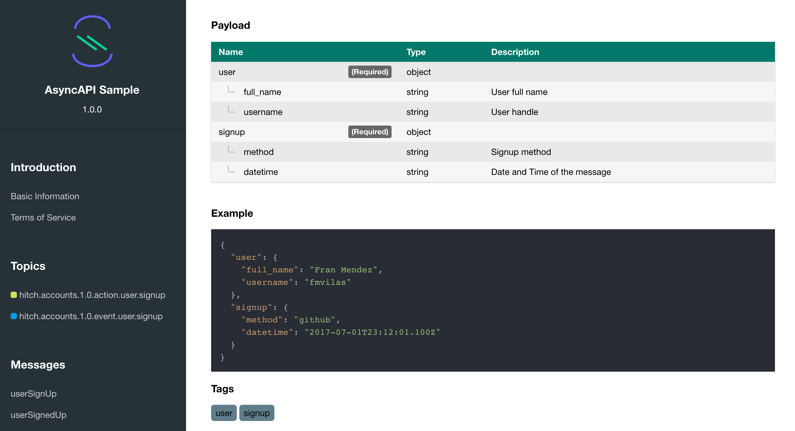

# AsyncAPI documentation generator

Use your AsyncAPI definition to generate beautiful human-readable documentation for your API.



## Installation

```bash
npm install -g asyncapi-docgen
```

## How to use it?

```bash
asyncapi-docgen path-to-asyncapi-file path-to-output-directory
```

or

```bash
adg path-to-asyncapi-file path-to-output-directory
```

## Requirements

* Node.js v7.6+

## Author/s

Fran Mendez &nbsp;&nbsp;[ @fmvilas](https://www.twitter.com/fmvilas)
